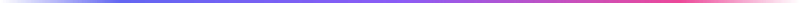

  <!-- HEADER -->

  

  <!-- NAME -->

  <h1 style="margin:-10;">
    rezan&nbsp;
    <picture>
      <source media="(prefers-color-scheme: dark)" srcset="assets/verified-dark.svg">
      
    </picture>
  </h1>

  <!-- TYPING ANIMATION -->

  <a href="https://github.com/r-yalcin">
    <picture>
      <source media="(prefers-color-scheme: dark)" srcset="https://readme-typing-svg.herokuapp.com?font=Inter&weight=700&size=28&duration=2500&pause=1000&color=E2E8F0&background=00000000&center=true&vCenter=true&width=700&lines=Software+Engineer;Architecting+Scalable+Systems;Precision+in+Every+Commit;Shipping+Excellence.">
      
    </picture>
  </a>

  <!-- SEPARATOR -->

  

   

  <!-- TECH STACK -->
  
   

  <h3><samp>Core Technologies & Architecture</samp></h3>

  

    
    
    
    
    
    
    
  

   

  <!-- SEPARATOR -->

  

   

  <!-- CONTACT -->

   

  

    
    &nbsp;&nbsp;&nbsp;
    
  

   

  <!-- FOOTER -->

  © 2026 r-yalcin · Engineered for performance.

   

  

   

  

